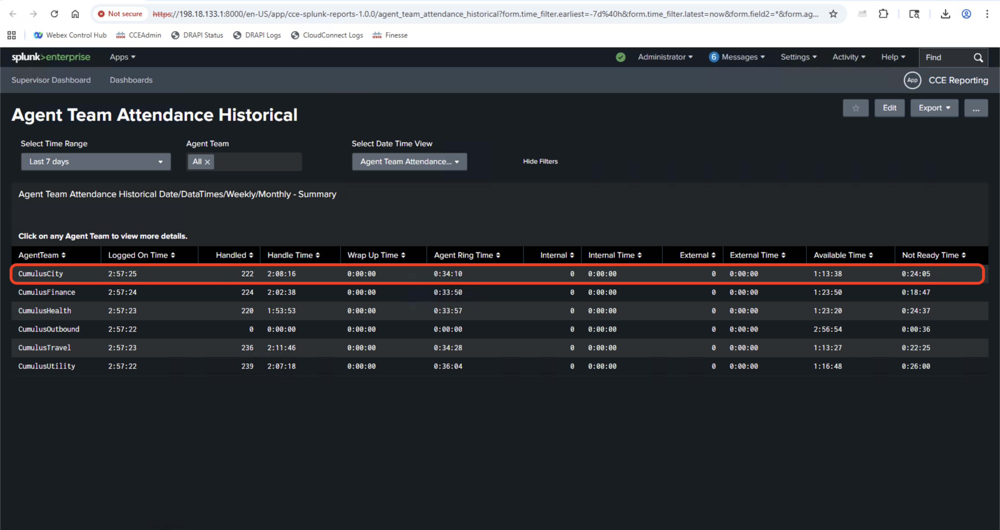

# Exercise 1 - Existing Stock Report Availability in Splunk

## Objective

Compare CUIC reports with equivalent Splunk dashboards to demonstrate real-time visibility and data fidelity.

## Overview

This exercise demonstrates how Splunk is showing real time data and the existing reports from CCE are already available:

- Real-time data updates
- Interactive visualizations
- Drill-down capabilities

---

## Part A: Agent Real-time Report Comparison

### Step 1: Access CUIC Agent Real-time Report

1. **Login to CUIC**
   - Open CUIC web interface.
   - Navigate to **Reports** on left navigation panel
   - Search for **Agent Real Time** report in the search bar.
   - Click on the **Agent Real Time** report
   - In the **Filter Modal** select teams 1000.AT and 1001.AT and click **>** icon
   - Click on **Run** Button

<figure markdown>
  { width="800" }
  <figcaption>Screenshot showing CUIC agent real-time report interface</figcaption>
</figure>

<figure markdown>
  { width="800" }
  <figcaption>Screenshot showing CUIC agent real-time report filter interface</figcaption>
</figure>

### Step 2: Access Equivalent Splunk Report

1. **Login to Splunk**

   - Open Splunk web interface
   - Navigate to **CCE Reporting** app

2. **Run Agent Real Time Report**
   - Navigate to **Dashboards** tab
   - Under Dashboard tab search for "Agent Real Time"
   - Click on the "Agent Real Time" report link"

<figure markdown>
  { width="800" }
  <figcaption>Screenshot showing Splunk agent real-time report</figcaption>
</figure>

    - Splunk should open the new report and the result should be as below in the screenshot

<figure markdown>
  { width="800" }
  <figcaption>Screenshot showing Splunk agent real-time report</figcaption>
</figure>

### Step 3: Compare Results

Compare Results in CUIC and Splunk - Validate if Splunk refreshes the report every 30 seconds and shows fresh data - Validate the data matches with CUIC Reports

---

## Part B: Skill Group Status Graphical Real-time

### Step 1: Access CUIC Skill Group Status Report

1. **Navigate to CUIC Report**
   - Open CUIC web interface.
   - Navigate to **Reports** on left navigation panel
   - Search for **Skill Group Status Graphical Real Time** report in the search bar.
   - Click on the **Skill Group Status Graphical Real Time** report
   - In the **Filter Modal** select Skill Groups PG1_CCM1.0001.SG, PG1_CCM1.0002.SG, PG1_CCM1.Straight.SG, PG1_CCM1.Conference.SG and click **>** icon
   - Click on **Run** Button

<figure markdown>
  { width="800" }
  <figcaption>Screenshot of CUIC skill group status graphical report</figcaption>
</figure>

<figure markdown>
  { width="800" }
  <figcaption>Screenshot of CUIC skill group status graphical report</figcaption>
</figure>

### Step 2: Access Equivalent Splunk Report

1. **Login to Splunk**

   - Open Splunk web interface
   - Navigate to **CCE Reporting** app

2. **Run Skill Group Status Graphical Real Time Report**
   - Navigate to **Dashboards** tab
   - Under Dashboard tab search for "Skill Group Status Graphical Real Time"
   - Click on the "Skill Group Status Graphical Real Time" report link

<figure markdown>
  { width="800" }
  <figcaption>Screenshot of Splunk skill group status graphical report</figcaption>
</figure>

    - Select same filter as CUIC Filter and the folowing report should show

<figure markdown>
  { width="800" }
  <figcaption>Screenshot of Splunk skill group status graphical report results</figcaption>
</figure>
    
### Step 3: Compare Results

Compare Results in CUIC and Splunk - Validate if Splunk refreshes the report every 30 seconds and shows fresh data - Validate the data matches with CUIC Reports and graphs are similar

---

## Part C: Agent Team Attendance Historical

### Step 1: Access CUIC Agent Team Attendance Historical Report

1. **Navigate to CUIC Report**
   - Open CUIC web interface.
   - Navigate to **Reports** on left navigation panel
   - Search for **Agent Team Attendance Historical** report in the search bar.
   - Click on the **Agent Team Attendance Historical** report
   - In the **Filter Modal** set date range to last 7 days and select teams 1000.AT and 1001.AT and click **>** icon
   - Click on **Run** Button

<figure markdown>
  { width="800" }
  <figcaption>Screenshot of CUIC team attendance historical report interface</figcaption>
</figure>

<figure markdown>
  { width="800" }
  <figcaption>Screenshot of CUIC team attendance historical report results</figcaption>
</figure>

### Step 2: Access Equivalent Splunk Report

1. **Login to Splunk**

   - Open Splunk web interface
   - Navigate to **CCE Reporting** app

2. **Run Agent Team Attendance Historical Report**
   - Navigate to **Dashboards** tab
   - Under Dashboard tab search for "Agent Team Attendance Historical"
   - Click on the "Agent Team Attendance Historical" report link

<figure markdown>
  { width="800" }
  <figcaption>Screenshot of Splunk team attendance historical report</figcaption>
</figure>

- Select same date range and team filters as CUIC Filter and the following report should show

<figure markdown>
  { width="800" }
  <figcaption>Screenshot of Splunk team attendance historical report results</figcaption>
</figure>

### Step 3: Compare Results and Drill-down Capabilities

Compare Results in CUIC and Splunk:

- Validate the attendance data matches between CUIC and Splunk reports
- Test drill-down functionality in Splunk to get detailed agent information
- Validate historical data accuracy for the selected date range

<figure markdown>
  { width="800" }
  <figcaption>Screenshot showing Splunk drill-down capabilities</figcaption>
</figure>

---

## Exercise 1 Summary

### Key Comparisons Completed

1. **Agent Real-time Report**: Real-time agent status and state information
2. **Skill Group Status Graphical Real-time**: Queue and service level monitoring
3. **Agent Team Attendance Historical**: Historical attendance and productivity data

### Benefits Demonstrated

- **Data Fidelity**: Splunk shows the same accurate data as CUIC reports
- **Real-time Updates**: Splunk provides automatic refresh capabilities
- **Enhanced Visualization**: More interactive and drill-down options
