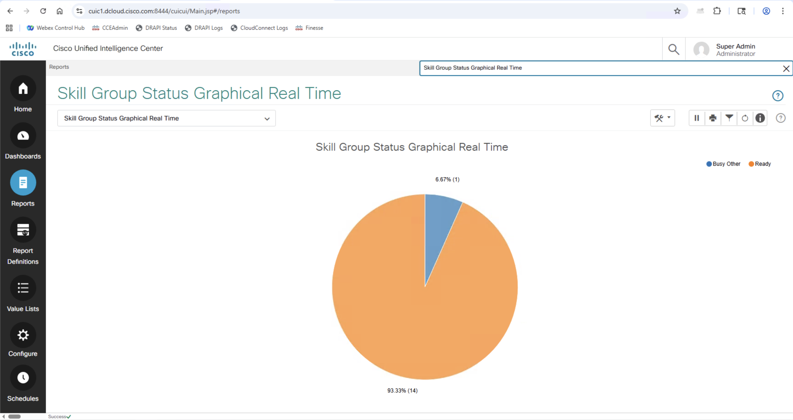
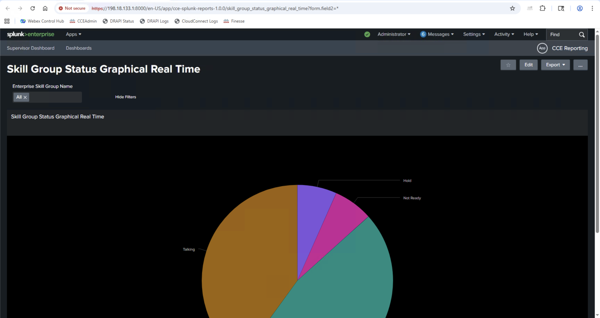

# Exercise 1 - Existing Stock Report Availability in Splunk

## Objective

Compare CUIC reports with equivalent Splunk dashboards to demonstrate real-time visibility and data fidelity.

## Overview

This exercise demonstrates how Splunk is showing real time data and the existing reports from CCE are already available:

- Real-time data updates
- Interactive visualizations
- Drill-down capabilities

---

## Part A: Agent Real-time Report Comparison

### Step 1: Access CUIC Agent Real-time Report

1. **Login to CUIC**
  - Open CUIC web interface:
    <figure markdown>
      { width="800" }
      <figcaption>CUIC login screen - enter your credentials to access the system</figcaption>
    </figure>
  - After successful login, you will see the CUIC main interface:
  - Navigate to **Reports** on left navigation panel
    <figure markdown>
      { width="800" }
      <figcaption>CUIC main interface - click on Reports in the left navigation</figcaption>
    </figure>
  - Search for **Agent Real Time** report in the search bar.
  - Click on the **Agent Real Time** report
    <figure markdown>
      { width="800" }
      <figcaption>CUIC Reports search interface showing Agent Real Time report</figcaption>
    </figure>
  - In the **Filter Modal** select all agents and click **>>** icon
    <figure markdown>
      { width="800" }
      <figcaption>CUIC filter modal - select all agents and click >> to move them to selected</figcaption>
    </figure>
  - Click on **Run** Button
  - The report will execute and display the agent real-time data:
    <figure markdown>
      { width="800" }
      <figcaption>CUIC Agent Real Time report results showing all agent data</figcaption>
    </figure>

### Step 2: Access Equivalent Splunk Report

1. **Login to Splunk**
  - Open Splunk web interface:
  - After successful login, you will see the Splunk main interface with available apps:
    <figure markdown>
      { width="800" }
      <figcaption>Splunk main interface - click on CCE Reporting app</figcaption>
    </figure>

  - Navigate to **CCE Reporting** app
    <figure markdown>
      { width="800" }
      <figcaption>Splunk Home Page to Open CCE Reporting App</figcaption>
    </figure>
  - You will see the Supervisor Dashboard with key metrics:
    <figure markdown>
      { width="800" }
      <figcaption>Splunk Supervisor Dashboard showing team performance insights</figcaption>
    </figure>

2. **Run Agent Real Time Report**
  - Navigate to **Dashboards** tab
  - Under Dashboard tab search for "Agent Real Time"
    <figure markdown>
      { width="800" }
      <figcaption>Splunk Dashboards list - search for Agent Real Time</figcaption>
    </figure>
  - Click on the "Agent Real Time" report link
  - Splunk will open the Agent Real Time dashboard showing live agent data:
    <figure markdown>
      { width="800" }
      <figcaption>Splunk Agent Real Time dashboard showing agent details with real-time status</figcaption>
    </figure>

### Step 3: Compare Results

Compare Results in CUIC and Splunk - Validate if Splunk refreshes the report every 30 seconds and shows fresh data - Validate the data matches with CUIC Reports

---

## Part B: Skill Group Status Graphical Real-time

### Step 1: Access CUIC Skill Group Status Report

1. **Navigate to CUIC Report**
   - Open CUIC web interface.
   - Navigate to **Reports** on left navigation panel
   - Search for **Skill Group Status Graphical Real Time** report in the search bar.
   - Click on the **Skill Group Status Graphical Real Time** report
    <figure markdown>
      { width="800" }
      <figcaption>Screenshot of CUIC skill group status graphical report</figcaption>
    </figure>
   - In the **Filter Modal** select All Skill Groups and click **>>** icon
   - Click on **Run** Button

<figure markdown>
  { width="800" }
  <figcaption>Screenshot of CUIC skill group status graphical report Filter Modal</figcaption>
</figure>
<figure markdown>
  { width="800" }
  <figcaption>Screenshot of CUIC skill group status graphical report</figcaption>
</figure>

### Step 2: Access Equivalent Splunk Report
  1. Open Splunk web interface
  - Navigate to **CCE Reporting** app

  - Navigate to **Dashboards** tab
  - Under Dashboard tab search for "Skill Group Status Graphical Real Time"
  - Click on the "Skill Group Status Graphical Real Time" report link

    <figure markdown>
      { width="800" }
      <figcaption>Screenshot of Splunk skill group status graphical report</figcaption>
    </figure>

  - Select same filter as CUIC Filter and the folowing report should show

    <figure markdown>
      { width="800" }
      <figcaption>Screenshot of Splunk skill group status graphical report results</figcaption>
    </figure>
    
### Step 3: Compare Results

Compare Results in CUIC and Splunk - Validate if Splunk refreshes the report every 30 seconds and shows fresh data - Validate the data matches with CUIC Reports and graphs are similar

---

## Part C: Agent Team Attendance Historical

### Step 1: Access CUIC Agent Team Attendance Historical Report

1. **Navigate to CUIC Report**
- Open CUIC web interface.
- Navigate to **Reports** on left navigation panel
- Search for **Agent Team Attendance Historical** report in the search bar.
- Click on the **Agent Team Attendance Historical** report
    <figure markdown>
      { width="800" }
      <figcaption>Screenshot of CUIC team attendance historical report interface</figcaption>
    </figure>
- In the **Filter Modal** select custom date range.
    <figure markdown>
      { width="800" }
      <figcaption>Screenshot of CUIC team attendance historical report Filter Custom Date Range</figcaption>
    </figure>
- Select a start date which is 7 days ago.
    <figure markdown>
      { width="800" }
      <figcaption>Screenshot of CUIC team attendance historical report Filter Custom Date Range Start Date</figcaption>
    </figure>
- Select all Agent Teams by clicking on **>>** button.
- Click on **Run** Button
    <figure markdown>
      { width="800" }
      <figcaption>Screenshot of CUIC team attendance historical report Filter Custom Date Range Start Date</figcaption>
    </figure>
    <figure markdown>
      { width="800" }
      <figcaption>Screenshot of CUIC team attendance historical report Filter Custom Date Range Start Date</figcaption>
    </figure>

### Step 2: Access Equivalent Splunk Report

1. **Login to Splunk**
- Open Splunk web interface
- Navigate to **CCE Reporting** app
- Navigate to **Dashboards** tab
- Under Dashboard tab search for "Agent Team Attendance Historical"
- Click on the "Agent Team Attendance Historical" report link
      <figure markdown>
        { width="800" }
        <figcaption>Screenshot of Splunk team attendance historical report</figcaption>
      </figure>
- Select same date range and team filters as CUIC Filter (by default last 7 days is selected) and the following report should show
      <figure markdown>
        { width="800" }
        <figcaption>Screenshot of Splunk team attendance historical report results</figcaption>
      </figure>
- Click on the 1st row to drill-down
      <figure markdown>
        { width="800" }
        <figcaption>Screenshot of Splunk team attendance historical report results</figcaption>
      </figure>

### Step 3: Compare Results and Drill-down Capabilities

Compare Results in CUIC and Splunk:
- Validate the attendance data matches between CUIC and Splunk reports
- Test drill-down functionality in Splunk to get detailed agent information
- Validate historical data accuracy for the selected date range

---

## Exercise 1 Summary

### Key Comparisons Completed

1. **Agent Real-time Report**: Real-time agent status and state information
2. **Skill Group Status Graphical Real-time**: Queue and service level monitoring
3. **Agent Team Attendance Historical**: Historical attendance and productivity data

### Benefits Demonstrated

- **Data Fidelity**: Splunk shows the same accurate data as CUIC reports
- **Real-time Updates**: Splunk provides automatic refresh capabilities
- **Enhanced Visualization**: More interactive and drill-down options
