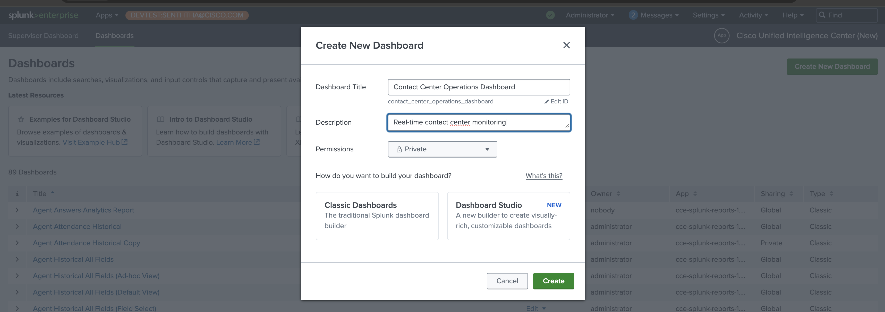
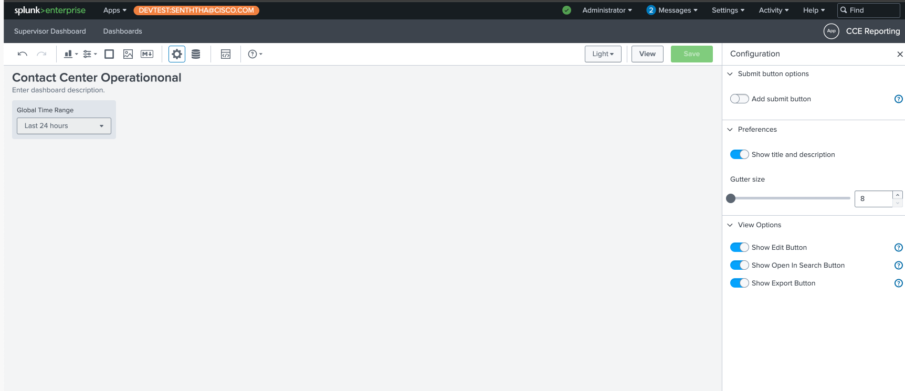
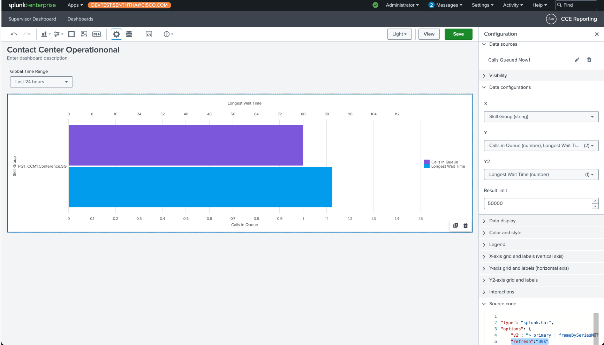
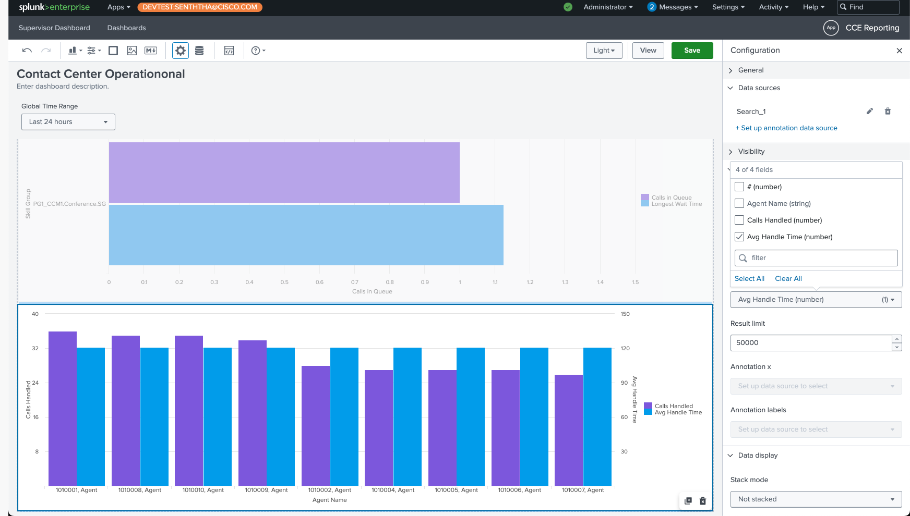

# Exercise 2 - Building Dashboards with Dashboard Studio

## Objective

Create a focused, interactive dashboard using Splunk's Dashboard Studio to provide real-time visibility into key contact center operations with two essential visualizations.

## Overview

This exercise demonstrates how to build an operational dashboard using Dashboard Studio that provides:

- Real-time queue monitoring with column charts
- Agent performance tracking with bar charts
- Modern, responsive dashboard interface

## Part A: Create Dashboard Studio Dashboard

### Step 1: Create New Dashboard Studio Dashboard

1. **Access Dashboard Studio**
   - Navigate to **Apps** > **CCE Reporting** > **Dashboards**
   - Click **Create New Dashboard**
   - Dashboard Title: "Contact Center Operations Dashboard"
   - Description: "Real-time contact center monitoring with key metrics"
   - Select **Dashboard Studio** (not Classic Dashboard)
   - Select **Grid**
   - Click **Create**

<figure markdown>
  { width="800" }
  <figcaption>Screenshot showing Dashboard Studio creation interface</figcaption>
</figure>

### Step 2: Configure Dashboard Settings

1. **Set Dashboard Properties**
   - Navigate to **Edit** mode in Dashboard Studio
   - Set **Default Time Range**: Last 24 hours

<figure markdown>
  { width="800" }
  <figcaption>Screenshot of Dashboard Studio configuration settings</figcaption>
</figure>

---

## Part B: Calls Queued Now - Bar Chart

### Step 1: Add Bar Chart Visualization

1. **Create New Visualization Panel**

   - Click **+ Add Chart** in Dashboard Studio
   - Select **Bar Chart** from visualization types

2. **Configure Data Source Query**
   - Under search in **Select data source** click on Create search link.
   - Enter

```spl
index=cce_rt sourcetype=cce:rt:skill_group_real_time
| stats latest(*) as * by SkillTargetID
| where RouterCallsQNow > 0
| join type=left SkillTargetID
    [ search index=cce_config sourcetype=cce:config:skill_group earliest=1
    | fields SkillTargetID EnterpriseName
    | rename  EnterpriseName as SkillGroupName ]
| eval QueuedCalls = RouterCallsQNow
| eval LongestCallWaiting = now()-RouterLongestCallInQ/1000
| table SkillGroupName QueuedCalls LongestCallWaiting
| sort -QueuedCalls
| rename SkillGroupName as "Skill Group", QueuedCalls as "Calls in Queue", LongestCallWaiting as "Longest Wait Time"
```

    - Under source coded section add refresh:30s in options

```json
        "options": {
        "query": "index=cce_rt sourcetype=cce:rt:skill_group_real_time\n| stats latest(*) as * by SkillTargetID\n| where RouterCallsQNow > 0\n| join type=left SkillTargetID\n    [ search index=cce_config sourcetype=cce:config:skill_group earliest=1\n    | fields SkillTargetID EnterpriseName\n    | rename  EnterpriseName as SkillGroupName ]\n| eval QueuedCalls = RouterCallsQNow\n| eval LongestCallWaiting = now()-RouterLongestCallInQ/1000\n| table SkillGroupName QueuedCalls LongestCallWaiting\n| sort -QueuedCalls\n| rename SkillGroupName as \"Skill Group\", QueuedCalls as \"Calls in Queue\", LongestCallWaiting as \"Longest Wait Time\"",
        "refresh":"30s"
    },
```

    - Click on Apply and close
    - Under Data Configuration Section Select
        - Select Skill Group for X
        - Calls in Queue and Longest Wait Time for Y
        - Longest Wait Time in Y2

<figure markdown>
  { width="800" }
  <figcaption>Screenshot of bar chart data source configuration</figcaption>
</figure>

---

## Part C: Agent Performance Leaderboard - Column Chart

### Step 1: Create Performance Data Query

1. **Add New Column Chart Visualization**

   - Click **+ Add Chart**
   - Select **Column Chart**
   - Title: "Top 10 Agent Performance (Last 24 Hours)"
   - Position below the column chart

2. **Configure Performance Query**

- Under search in **Select data source** click on Create search link.
- Enter

```spl
index=cce_hds sourcetype="cce:hds:agent_interval"
| join type=left SkillTargetID
    [ search index=cce_config sourcetype=cce:config:agent earliest=1
    | fields SkillTargetID PersonID
    ]
| join type=left PersonID
    [ search index=cce_config sourcetype=cce:config:person earliest=1
    | eval AgentName = LastName . ", " . FirstName
    | fields PersonID AgentName
    ]
| join type=left SkillTargetID DateTime
    [ search index=cce_hds sourcetype=cce:hds:agent_skill_group_interval earliest=-24h@h latest=now
    | where CallsHandled > 0
    | fields SkillTargetID DateTime CallsHandled HandledCallsTime
    ]
| stats sum(CallsHandled) as TotalCalls sum(HandledCallsTime) as TotalHandleTime by AgentName SkillTargetID
| where TotalCalls > 0
| eval AHT = round(TotalHandleTime / TotalCalls, 0)
| eval AHT_Minutes = round(AHT / 60, 1)
| eval AHT_Formatted = tostring(AHT, "duration")
| eval Efficiency_Score = round((TotalCalls * 100) / (TotalCalls + AHT_Minutes), 1)
| sort -TotalCalls
| streamstats count as Rank
| table Rank AgentName TotalCalls AHT
| rename Rank as "#",
    AgentName as "Agent Name",
    TotalCalls as "Calls Handled",
    AHT as "Avg Handle Time"
```

    - Click on Apply and close
    - Under Data Configuration Section Select
        - Select Agent Name for X
        - Agent Name, Calls Handled and Average Handle Time for Y
        - Average Handle Time in Y2

<figure markdown>
  { width="800" }
  <figcaption>Screenshot of agent performance data query</figcaption>
</figure>

---

## Summary

### What You've Accomplished

- ✅ Built real-time queue monitoring with 30-second auto-refresh for immediate visibility
- ✅ Implemented agent performance leaderboard showing top performers over 24-hour periods
- ✅ Configured dual-axis visualizations combining call volume and wait time metrics
- ✅ Established responsive dashboard layout optimized for different screen sizes

### Key Benefits

- **Modern User Interface**: Dashboard Studio provides enhanced visual appeal and better user experience
- **Real-time Monitoring**: 30-second refresh ensures supervisors see current queue status
- **Performance Visibility**: Agent leaderboard promotes healthy competition and recognition
- **Dual Metrics Display**: Column charts show both primary and secondary KPIs simultaneously
- **Mobile Responsive**: Dashboards automatically adapt to different devices and screen sizes
