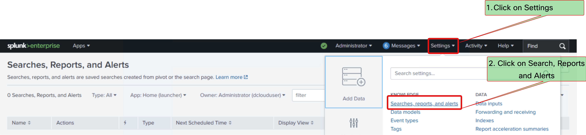

# Exercise 3 - Alerting for Agent Not Ready Duration

## Objective

Implement proactive alerting in Splunk to monitor agents who have been in "Not Ready" state for more than 5 minutes and automatically notify supervisors when this threshold is breached.

## Overview

This exercise demonstrates how to create an intelligent alert that:

- Monitors real-time agent states
- Detects when agents remain in "Not Ready" state for extended periods
- Sends automated notifications with contextual information
- Helps supervisors take immediate corrective action
- Improves overall agent productivity and availability

---

## Part A: Agent Not Ready Duration Alert

### Step 1: Create Not Ready State Alert

1. **Access Splunk Alert Creation**
   - Navigate to **Settings** > **Searches, reports, and alerts**
<figure markdown>
  { width="800" }
  <figcaption>Screenshot showing alert trigger creation</figcaption>
</figure>
   - Click **New Alert**
<figure markdown>
  { width="800" }
  <figcaption>Screenshot showing alert trigger creation</figcaption>
</figure>


### Step 2: Configure Not Ready Duration Alert

- Enter title as **Agent Not Ready Alert**
- Enter the SPL

```spl
index=cce_rt sourcetype=cce:rt:agent_real_time
| stats latest(*) as * by SkillTargetID
| where operation != "D"
| where AgentState == 2
| eval CurrentTime = now()
| eval StateChangeTime = DateTimeLastStateChange/1000
| eval StateChangeTime_fmt = strftime(StateChangeTime, "%Y-%m-%d %H:%M:%S.%3N")
| eval NotReadyDuration = CurrentTime - StateChangeTime
| where NotReadyDuration > 300
| join type=left SkillTargetID
    [ search index=cce_config sourcetype=cce:config:agent earliest=1
    | fields SkillTargetID PersonID ]
| join type=left PersonID
    [ search index=cce_config sourcetype=cce:config:person earliest=1
    | eval AgentName = LastName . ", " . FirstName
    | fields PersonID AgentName LoginName ]
| join type=left ReasonCode
    [ search index=cce_config sourcetype=cce:config:reason_code earliest=1
    | fields ReasonCode ReasonText ]
| eval NotReadyMinutes = round(NotReadyDuration / 60, 1)
| eval AlertMessage = "Agent " . AgentName . " (" . LoginName . ") has been in Not Ready state for " . NotReadyMinutes . " minutes"
| eval ReasonDescription = if(isnull(ReasonText) OR ReasonText == "", "No Reason Code", ReasonText)
| table AlertMessage AgentName LoginName SkillGroupName ReasonDescription NotReadyMinutes StateChangeTime_fmt
| sort -NotReadyMinutes
| rename AgentName as "Agent Name",
    LoginName as "Login Name",
    ReasonDescription as "Reason Code",
    NotReadyMinutes as "Duration (Minutes)",
    StateChangeTime_fmt as "State Change Time"
```

<figure markdown>
  { width="800" }
  <figcaption>Screenshot showing alert trigger condition settings</figcaption>
</figure>

### Step 3: Configure Alert Timing and Schedule

1. **Set Alert Timing**

   - **Alert Type**: Scheduled & "Run on Cron Schedule"
   - **Cron Expression**: `*/5 * * * *` (Run every 5 minutes)

<figure markdown>
  { width="800" }
  <figcaption>Screenshot showing alert trigger condition settings</figcaption>
</figure>

### Step 4: Configure Alert Trigger Conditions

1. **Set Trigger Condition**
   - **Trigger Condition**: Number of Results
   - **Condition**: is greater than `0`
   - **Once**: Enable (Send separate alert for each agent)
   - **Add Actions** and select **Add to Triggered Alerts**

<figure markdown>
  { width="800" }
  <figcaption>Screenshot showing alert trigger condition settings</figcaption>
</figure>
<figure markdown>
  { width="800" }
  <figcaption>Screenshot showing alert trigger condition Created</figcaption>
</figure>


### Step 5: Test and Validate Alert

1. **Test Alert Configuration**
   - Click **Save Alert**
<figure markdown>
  { width="800" }
  <figcaption>Screenshot showing alert trigger condition Created</figcaption>
</figure>
   - Monitor for the next few minutes
   - Verify the alerts are coming in by checking alerts in **Activity** > **Triggered Alerts**
   

<figure markdown>
  { width="800" }
  <figcaption>Screenshot showing alert test execution results</figcaption>
</figure>

---

## Summary

### What You've Accomplished

- ✅ Created focused Not Ready duration alert for agents exceeding 5-minute threshold
- ✅ Implemented automated email notifications with rich contextual information
- ✅ Configured per-result alerting to handle multiple agents simultaneously

### Key Benefits

- **Proactive Management**: Automatic detection of productivity issues before they impact service
- **Rapid Response**: Immediate notifications enable swift supervisor intervention
- **Operational Efficiency**: Reduced manual monitoring overhead frees supervisors for strategic tasks
