# Exercise 4 - Utilizing Machine Learning for Call Forecasting and Anomaly Detection

## Objective

Implement advanced machine learning capabilities in Splunk to predict call volumes, detect anomalies, and provide intelligent insights for contact center optimization.

## Overview

This exercise demonstrates how to leverage Splunk's Machine Learning Toolkit (MLTK) to:

- Build predictive models for call forecasting
- Detect unusual patterns and anomalies
- Enable data-driven decision making

## Prerequisites

1. **Splunk AI Toolkit is Installed**
   - For this exercise the App is already installed

---

## Part A: Build Call Forecasting Model Based on Historical Data


### Step 1: Build Time Series Forecasting Model

1. **Access AI Toolkit for Forecasting**

   - Navigate to **AI Toolkit** app, by clicking on the Apps dropdown
<figure markdown>
  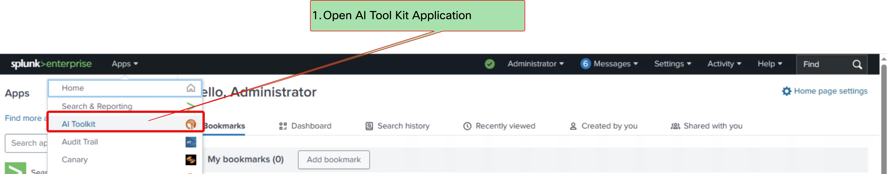{ width="800" }
  <figcaption>Screenshot showing AI Toolkit App</figcaption>
</figure>
   - Click **Experiments** > **Forecast Time Series**
<figure markdown>
  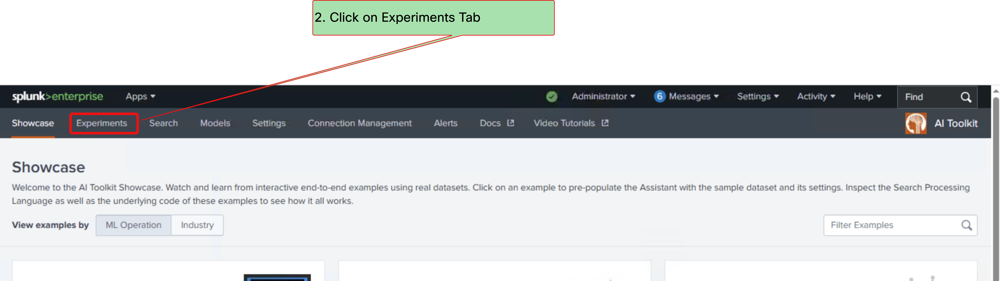{ width="800" }
  <figcaption>Screenshot showing opening Experiments tab</figcaption>
</figure>
   - Click Create New Experiment
<figure markdown>
  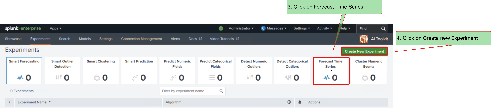{ width="800" }
  <figcaption>Screenshot showing Forecast Time Series</figcaption>
</figure>
   - Select **Forecast Time Series** as experiment type and enter any experiment title
<figure markdown>
  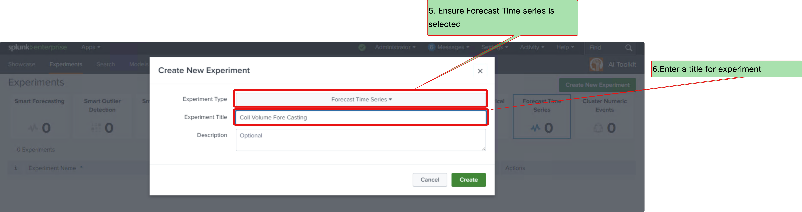{ width="800" }
  <figcaption>Screenshot showing Forecast Time Series</figcaption>
</figure>

2. **Configure Experiment Settings**
   - Enter SPL

```spl
index="cce_demo"
| eval _time = strptime(DateTime, "%Y-%m-%d %H:%M:%S")
| timechart span=15m sum(CallsOffered) as TotalCallsOffered
| makecontinuous _time span=15m
| fillnull value=0
```

<figure markdown>
  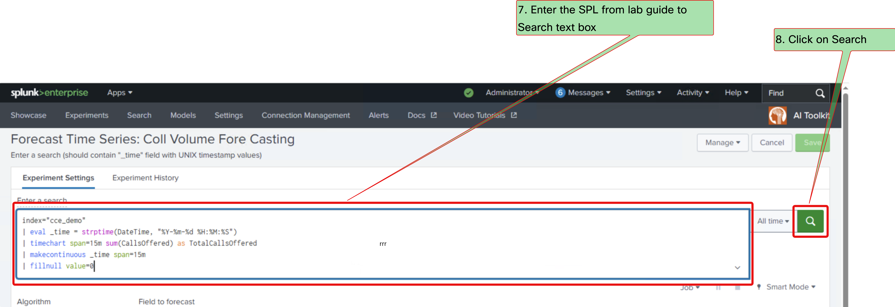{ width="800" }
  <figcaption>Screenshot showing Forecast Time Series SPL</figcaption>
</figure>

- Under Algorithm Select **Kalman Filter**
- Select **TotalCallsOffered** in Field to forecast
- Select **LLP5** as method
- Enter 700 for **Future Timespan** and **Holdback**
- Enter confidence interval as 95
- Enter 672 as period
<figure markdown>
  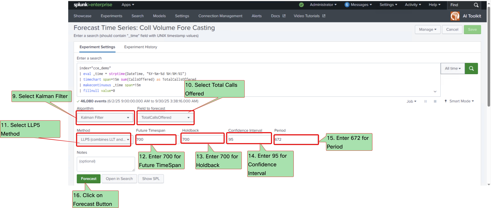{ width="800" }
  <figcaption>Screenshot showing Forecast Time Series Configuration</figcaption>
</figure>


### Step 2: Generate and Validate Forecast

1. **Run Forecasting Model**

   - Click on **Forecast** Button
   - Observe forecasting results are shown as in image
<figure markdown>
  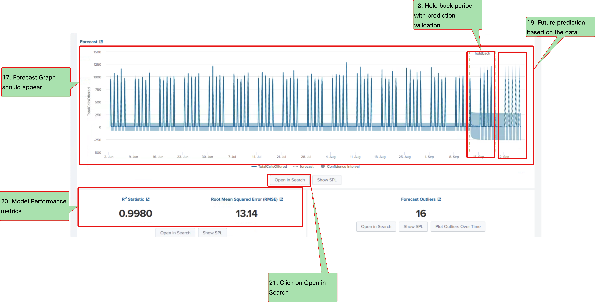{ width="800" }
  <figcaption>Screenshot showing Forecast Time Series Graph</figcaption>
</figure>

### Step 3: Schedule Forecast Retraining

1. **Schedule Configuration**
   - Click on **Open in Search** Buton
   - Ensure the SPL shows the parameter selected
   - Click on **Save As** Report
<figure markdown>
  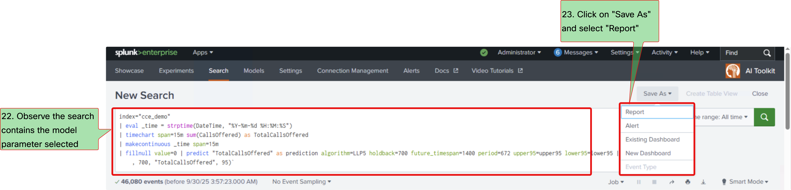{ width="800" }
  <figcaption>Screenshot showing Forecast Time Series Scheduling</figcaption>
</figure>

   - Enter the title as "Scheduled Call Forecast Training" and click Save
<figure markdown>
  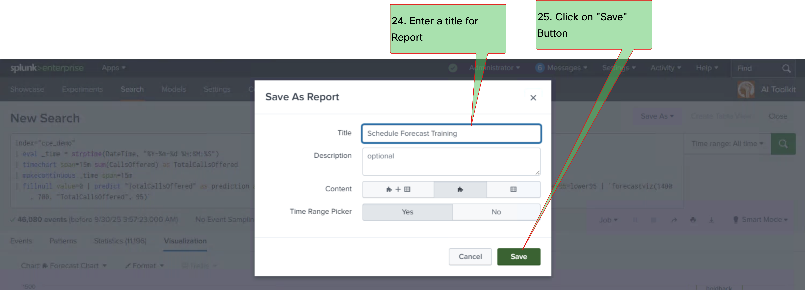{ width="800" }
  <figcaption>Screenshot showing Forecast Time Series Scheduling</figcaption>
</figure>
   - In the next popup click on **Schedule** and Click on View
<figure markdown>
  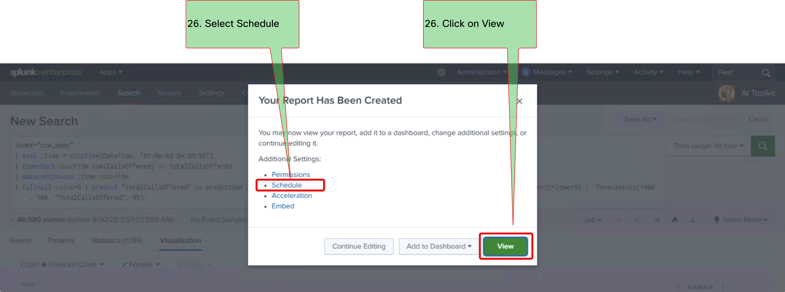{ width="800" }
  <figcaption>Screenshot showing Forecast Time Series Scheduling</figcaption>
</figure>
   - Click on the **Schedule Report** and configure it to **Run Every Week** **Monday** **6:00**  
   - Click Save
<figure markdown>
  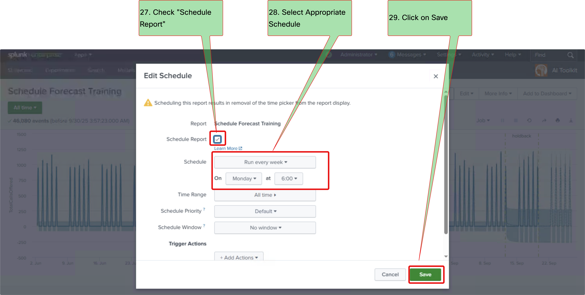{ width="800" }
  <figcaption>Screenshot showing Forecast Time Series Scheduling</figcaption>
</figure>

---

## Part B: Anomaly Detection for Call Patterns

### Step 1: Configure Numeric Outlier Detection

1. **Access AI Experiments**
   - Navigate to **AI Toolkit** > **Experiments**
<figure markdown>
  { width="800" }
  <figcaption>Screenshot showing opening Experiments tab</figcaption>
</figure>
   - Click **Create New Experiment**
<figure markdown>
  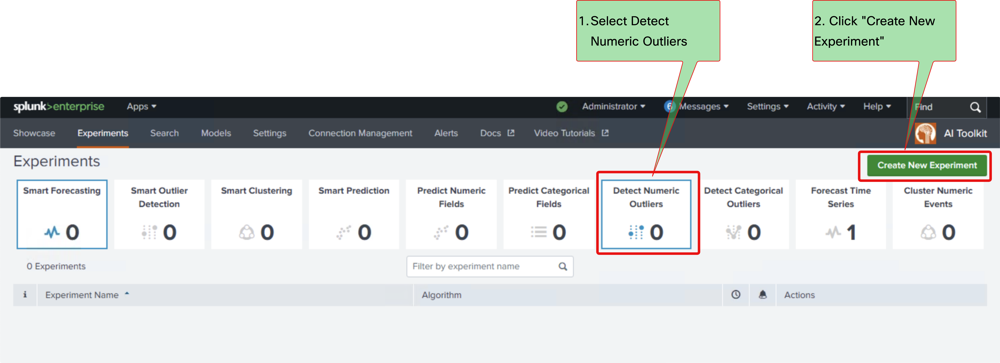{ width="800" }
  <figcaption>Screenshot showing Creating new experiment</figcaption>
</figure>
   - Choose **Detect Numeric Outliers** as experiment type and enter any experiment title
<figure markdown>
  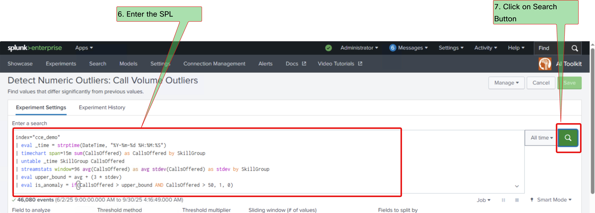{ width="800" }
  <figcaption>Screenshot showing Creating new experiment</figcaption>
</figure>

### Step 2: Configure Experiment Settings

1. **Enter SPL Query for Anomaly Detection**

```spl
index="cce_demo"
| eval _time = strptime(DateTime, "%Y-%m-%d %H:%M:%S")
| timechart span=15m sum(CallsOffered) as CallsOffered by SkillGroup
| untable _time SkillGroup CallsOffered
| streamstats window=96 avg(CallsOffered) as avg stdev(CallsOffered) as stdev by SkillGroup
| eval upper_bound = avg + (3 * stdev)
| eval is_anomaly = if(CallsOffered > upper_bound AND CallsOffered > 50, 1, 0)
```
and click on Search
<figure markdown>
  { width="800" }
  <figcaption>Screenshot showing Outlier Detection SPL</figcaption>
</figure>

2. **Configure Outlier Detection Parameters**

- Select **CallsOffered** as the field to analyze for outliers
- Under **Threshold Method** select **Standard Deviation**
- Set threshold multiplier to **3**
- Select **SkillGroup** as the field to split by
<figure markdown>
  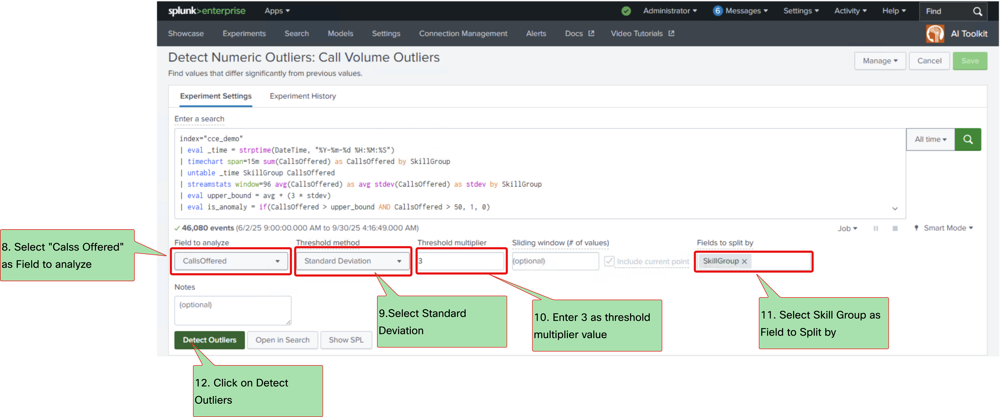{ width="800" }
  <figcaption>Screenshot showing Outlier Detection Configuration</figcaption>
</figure>

### Step 3: Run Outlier Detection Analysis

1. **Execute Outlier Detection**
   - Click on **Detect Outliers** Button
   - Observe anomaly detection results showing skill groups with abnormal call patterns
   - Review the outlier scores and identified anomalies
<figure markdown>
  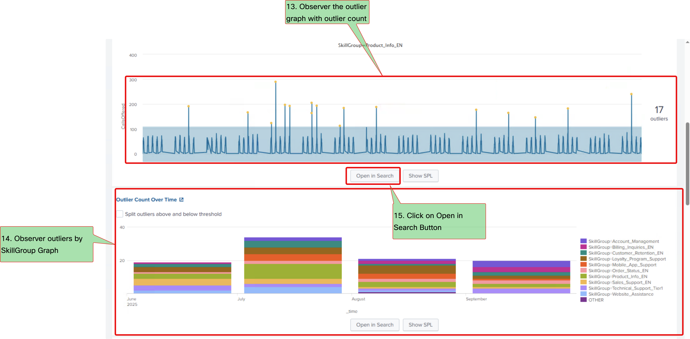{ width="800" }
  <figcaption>Screenshot showing Outlier Detection Graphs</figcaption>
</figure>

### Step 4: Schedule Anomaly Detection Retraining

1. **Create Scheduled Report**
   - Click on **Open in Search** Button
   - Ensure the SPL shows the parameters selected in the experiment
   - Click on **Save As** Report
<figure markdown>
  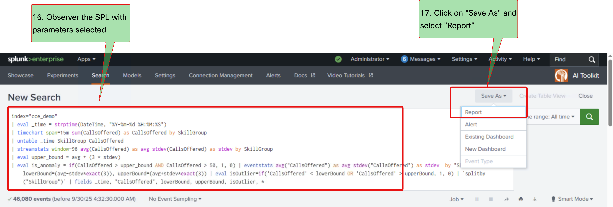{ width="800" }
  <figcaption>Screenshot showing Outlier Detection Report</figcaption>
</figure>
   - Enter the title as "Scheduled Call Pattern Anomaly Detection" and Click Save
<figure markdown>
  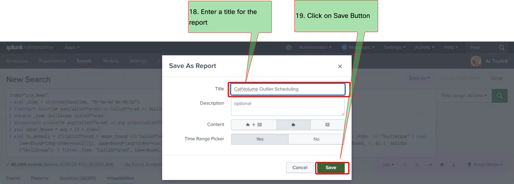{ width="800" }
  <figcaption>Screenshot showing Outlier Detection Report</figcaption>
</figure>
   - In the next popup click on **Schedule** and View Button
<figure markdown>
  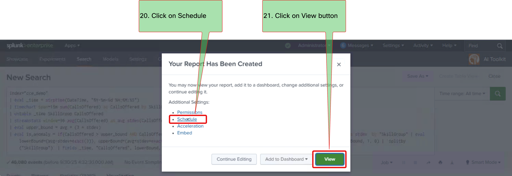{ width="800" }
  <figcaption>Screenshot showing Outlier Detection Schedule</figcaption>
</figure>

   - Click on the **Schedule Report** and configure it to **Run Every Day** at **2:00 AM**
   - Click Save
<figure markdown>
  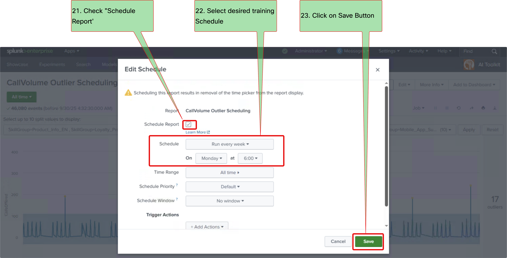{ width="800" }
  <figcaption>Screenshot showing Outlier Detection Schedule</figcaption>
</figure>


---

## Summary

### What You've Accomplished

- ✅ Implemented time series forecasting using Splunk MLTK for call volume prediction
- ✅ Built automated anomaly detection system using LocalOutlierFactor algorithm
- ✅ Created scheduled model retraining for both forecasting and anomaly detection

### Key Benefits

- **Predictive Intelligence**: Forecast call volumes 3 days in advance for better planning
- **Automated Anomaly Detection**: Real-time identification of unusual call patterns
- **Self-Maintaining Models**: Scheduled retraining keeps models current with data trends
- **Proactive Management**: Early warning system for operational issues
