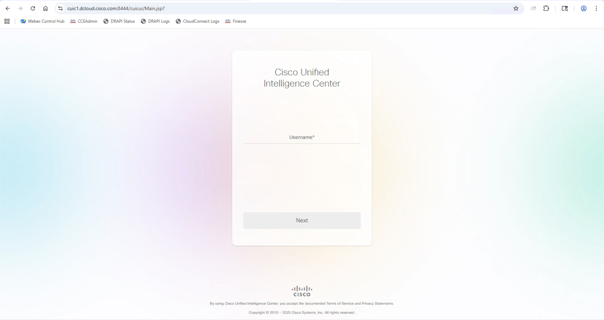
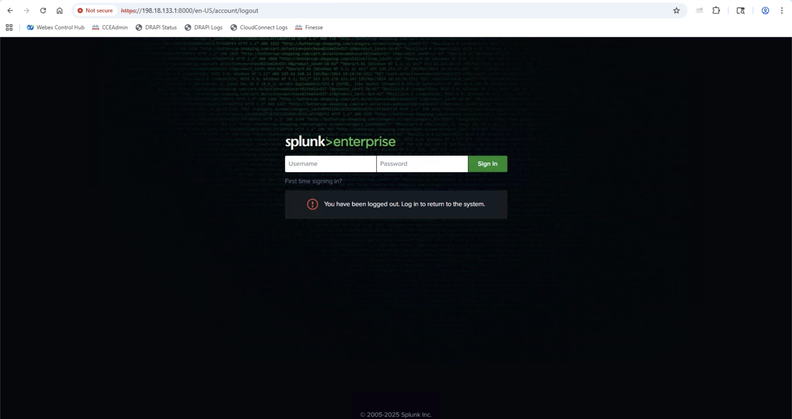

# Overview

## Lab Session Access

To access your lab session, please open the following URL:

!!! info "Lab Session"
      Click the link above to access your dedicated lab environment. This will open your lab session where you can follow along with the exercises. 
      **🔗 [Open Lab Session (click here)](https://expo.ciscodcloud.com/4rr9djtqlzsn487mky74y07iy)**

## Lab Prerequisites

Before starting this lab, you'll need to download and install the required Splunk app package:

!!! download
      1. Download the `cce-splunk-reports-1.0.0-app.tar` file using the link below
      2. In your Splunk instance, go to **Apps** → **Manage Apps**
      3. Click **Install app from file**
      4. Upload the downloaded tar file
      5. Restart Splunk when prompted
      6. Copy the below url in WorkStation 2 to download the 'CCE Splunk Reports App' file.
       
       
      <copy>https://webexcc-sa.github.io/LAB-2323/assets/cce-splunk-reports-1.0.0-app.tar</copy>

## Lab Endpoints & Credentials

### CUIC Access

| Key        | Value                                                            |
| ---------- | ---------------------------------------------------------------- |
| `URL`      | <copy>https://cuic1.dcloud.cisco.com:8444/cuicui/Main.jsp</copy> |
| `Username` | <copy>administrator</copy>                                       |
| `Password` | <copy>C1sco12345</copy>                                          |

When you access the CUIC URL, you should see the Cisco Unified Intelligence Center login screen:

<figure markdown>
  { width="800" }
  <figcaption>CUIC login interface - enter your administrator credentials</figcaption>
</figure>

### Splunk Access

| Key        | Value                                                          |
| ---------- | -------------------------------------------------------------- |
| `URL`      | <copy>https://198.18.133.1:8000/en-US/app/launcher/home</copy> |
| `Username` | <copy>dclouduser</copy>                                        |
| `Password` | <copy>dcloud@123</copy>                                        |

When you access the Splunk URL, you should see the Splunk Enterprise login screen:

<figure markdown>
  { width="800" }
  <figcaption>Splunk Enterprise login interface - enter your dclouduser credentials</figcaption>
</figure>

### Workstation Access

**WKST1:**

| Key        | Value                        |
| ---------- | ---------------------------- |
| `Username` | <copy>DCLOUD\sjeffers</copy> |
| `Password` | <copy>C1sco12345</copy>      |

**WKST2:**

| Key        | Value                        |
| ---------- | ---------------------------- |
| `Username` | <copy>DCLOUD\rbarrows</copy> |
| `Password` | <copy>C1sco12345</copy>      |

## Getting Started

This lab leverages Cisco dCloud ...
