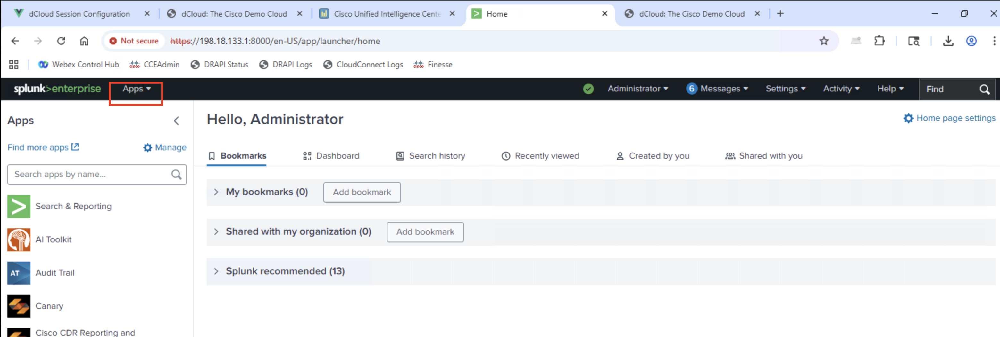

# Overview

## Lab Session Access

To access your lab session, please open the following URL:

!!! info "Lab Session | Workstation 1 Setup"
      Click the link above to access your dedicated lab environment. This will open your lab session where you can follow along with the exercises. 
      **🔗 [Open Lab Session (click here)](https://expo.ciscodcloud.com/4rr9djtqlzsn487mky74y07iy)**

1. Once you open the above link, you will redirected to the below screen. Click on Explore.
      <figure markdown>
        { width="800" }
      </figure>
- Enter your Email address and check the terms and condition to start the lab.
      <figure markdown>
        { width="800" }
      </figure>
- Open both Work Station 1 & 2, by clicking on the Remote Desktop links.
      <figure markdown>
        { width="800" }
      </figure>
- In Work Station 1, Start the "Start Call Simulator.bat" file.
      <figure markdown>
        { width="800" }
      </figure>
- Click okay on the pop-up and leave 'Work Station 1' alone as it simulates calls data on which we will perform later on.
      <figure markdown>
        { width="800" }
      </figure>

## Lab Prerequisites
Come to **Workstation 2**
 
Before starting this lab, you'll need to download and install the required Splunk app package:

!!! download
      <copy>https://webexcc-sa.github.io/LAB-2323/assets/cce-splunk-reports-1.0.0-app.tar</copy>

1. Copy the Download URL mentioned above.
      <figure markdown>
        { width="800" }
      </figure>
2. Open **Workstation 2**.
3. Paste the download URL in **Workstation 2** chrome browser. This will download `cce-splunk-reports-1.0.0-app.tar` file in Workstation 2's Downloads folder.
      <figure markdown>
        { width="800" }
      </figure>
      <figure markdown>
        { width="800" }
      </figure>
4. Open Splunk in Workstation 2 Chrome and Login.

    !!! note "Splunk Access Point & Credentials"
          | Key        | Value                                                          |
          | ---------- | -------------------------------------------------------------- |
          | `URL`      | <copy>https://198.18.133.1:8000/en-US/app/launcher/home</copy> |
          | `Username` | <copy>dclouduser</copy>                                        |
          | `Password` | <copy>dcloud@123</copy>                                        |
    
      <figure markdown>
        { width="800" }
      </figure>
      
      <figure markdown>
        { width="800" }
      </figure>
      
      <figure markdown>
        { width="800" }
      </figure>
5. Navigate to Manage Apps page.
      <figure markdown>
        { width="800" }
      </figure>
      
      <figure markdown>
        { width="800" }
      </figure>
6. Click on Install App from file.
      <figure markdown>
        { width="800" }
      </figure>
7. Browse the recently downloaded file from the downloads folder and upload it.
      <figure markdown>
        { width="800" }
      </figure>
      <figure markdown>
        { width="800" }
      </figure>
      <figure markdown>
        { width="800" }
      </figure>
      <figure markdown>
        { width="800" }
      </figure>
8. Come to Splunk's home page, and newly installed CCE Reporting Splunk App will be visible under Splunk.
      <figure markdown>
        { width="800" }
      </figure>
      <figure markdown>
        { width="800" }
      </figure>

## Lab Endpoints & Credentials

### Splunk Access

| Key        | Value                                                          |
| ---------- | -------------------------------------------------------------- |
| `URL`      | <copy>https://198.18.133.1:8000/en-US/app/launcher/home</copy> |
| `Username` | <copy>dclouduser</copy>                                        |
| `Password` | <copy>dcloud@123</copy>                                        |

When you access the Splunk URL, you should see the Splunk Enterprise login screen:

<figure markdown>
  { width="800" }
  <figcaption>Splunk Enterprise login interface - enter your dclouduser credentials</figcaption>
</figure>

### CUIC Access

| Key        | Value                                                            |
| ---------- | ---------------------------------------------------------------- |
| `URL`      | <copy>https://cuic1.dcloud.cisco.com:8444/cuicui/Main.jsp</copy> |
| `Username` | <copy>administrator</copy>                                       |
| `Password` | <copy>C1sco12345</copy>                                          |

When you access the CUIC URL, you should see the Cisco Unified Intelligence Center login screen:

<figure markdown>
  { width="800" }
  <figcaption>CUIC login interface - enter your administrator credentials</figcaption>
</figure>

## Getting Started

This lab leverages Cisco dCloud ...
